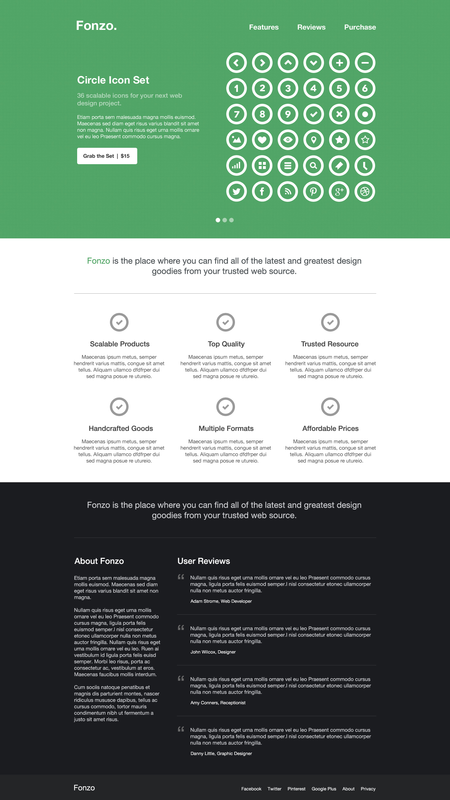

# Fonzo

[See the site here!](https://fonzo-website.appspot.com/) by [@jonathanslima](https://github.com/jonathanslima)

### Developers
- [Jonathan](https://github.com/jonathanslima)

### Workflow
- Bower
- Gulp
	+ autoprefixer
	+ browser-sync
	+ gulp
	+ contrib-copy
	+ cssmin
	+ htmlmin
	+ imagemin
	+ postcss
	+ stylus
	+ uglify
	+ watch
- Google App Engine
- Lost
- Sprites
- Stylus

### About the project

A learning project to develop skills through practice.

Link to main project: [Training Projects](https://github.com/training-projects)